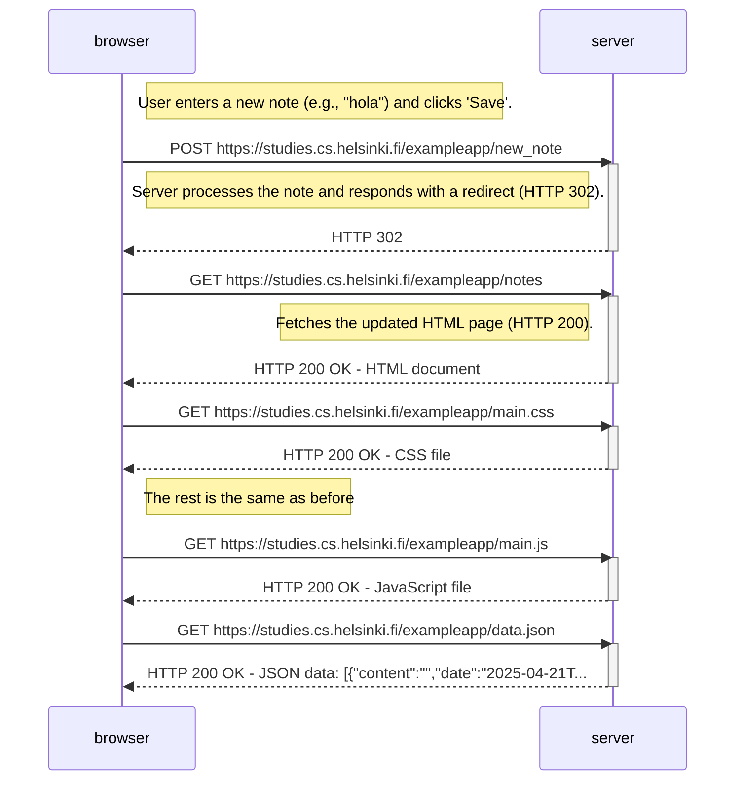
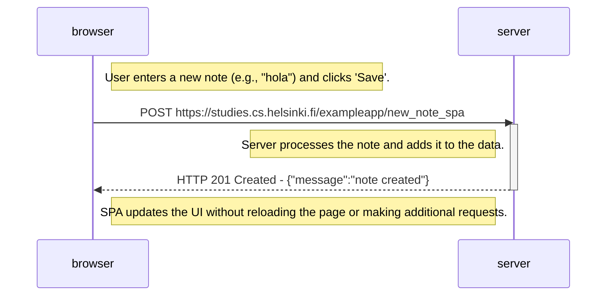

# Part 0

## 📠Exercise 0.4 - Classic Form

```mermaid
sequenceDiagram
    participant browser
    participant server

    Note right of browser: User enters a new note (e.g., "hola") and clicks 'Save'.
    browser->>server: POST https://studies.cs.helsinki.fi/exampleapp/new_note
    activate server
    Note left of server: Server processes the note and responds with a redirect (HTTP 302).
    server-->>browser: HTTP 302
    deactivate server

    browser->>server: GET https://studies.cs.helsinki.fi/exampleapp/notes
    activate server
    Note left of server: Fetches the updated HTML page (HTTP 200).
    server-->>browser: HTTP 200 OK - HTML document
    deactivate server

    browser->>server: GET https://studies.cs.helsinki.fi/exampleapp/main.css
    activate server
    server-->>browser: HTTP 200 OK - CSS file
    deactivate server
    Note right of browser: The rest is the same as before

    browser->>server: GET https://studies.cs.helsinki.fi/exampleapp/main.js
    activate server
    server-->>browser: HTTP 200 OK - JavaScript file
    deactivate server

    browser->>server: GET https://studies.cs.helsinki.fi/exampleapp/data.json
    activate server
    server-->>browser: HTTP 200 OK - JSON data: [{"content":"","date":"2025-04-21T...
    deactivate server
```

## 📠Exercise 0.5 - SPA

```mermaid
sequenceDiagram
    participant browser
    participant server

    Note right of browser: User enters a new note (e.g., "hola") and clicks 'Save'.
    browser->>server: POST https://studies.cs.helsinki.fi/exampleapp/new_note_spa
    activate server
    Note left of server: Server processes the note and adds it to the data.
    server-->>browser: HTTP 201 Created - {"message":"note created"}
    deactivate server

    Note right of browser: SPA updates the UI without reloading the page or making additional requests.
```
